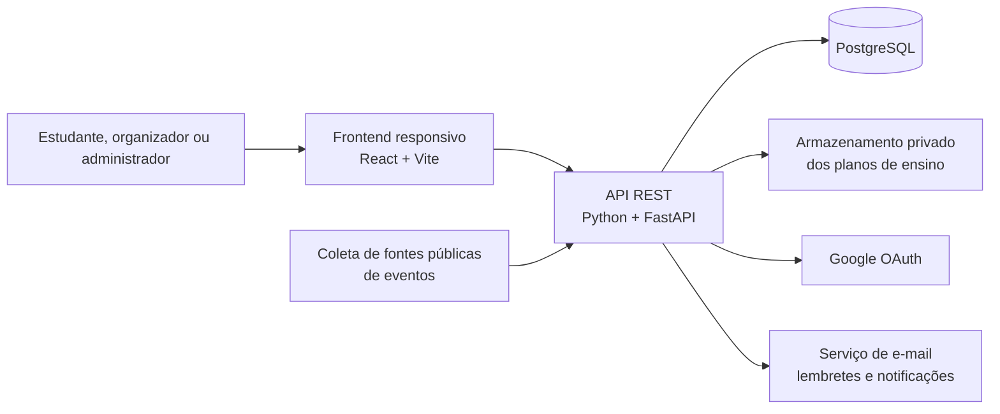

# Arquitetura de Software

Este documento registra uma **proposta de arquitetura** para a Agenda UnB. Ele detalha como a aplicação pode evoluir a partir do frontend existente e dos requisitos em [`requisitos.md`](requisitos.md), seguindo os termos e as rotas definidos em [`padroes.md`](padroes.md).

!!! warning "Proposta para validação da equipe"
    React e Vite já estão no repositório. Python/FastAPI, PostgreSQL, SQLAlchemy, Alembic e Docker aparecem como proposta para a arquitetura do produto; ainda precisam ser aprovados pela equipe antes de serem tratados como decisões implementadas. Hospedagem, armazenamento de arquivos e provedores de e-mail também estão em aberto.

## 1. Objetivo e escopo

A Agenda UnB reúne duas agendas que hoje ficam separadas: eventos públicos dos campi e compromissos acadêmicos privados dos estudantes. A aplicação deve permitir consultar eventos, organizar avaliações de turmas e, na evolução prevista, extrair datas de planos de ensino para revisão pelo estudante.

O produto é uma aplicação web responsiva. A interface para celular é a mesma aplicação web adaptada à tela; não está previsto um aplicativo nativo. A plataforma não substitui o SIGAA e não controla matrícula, notas ou frequência. Conforme o documento de visão, o estudante informa as próprias turmas, pois não há integração de matrícula com o SIGAA definida.

## 2. Visão geral

O frontend envia e recebe dados JSON pela API. A API aplica as regras de negócio, valida a identidade e as permissões do usuário, consulta ou atualiza o banco e coordena integrações externas. O banco guarda dados estruturados; os PDFs ficam em armazenamento de arquivos com acesso restrito, e o banco mantém os metadados e a referência ao arquivo.

Eventos públicos aprovados podem ser consultados sem login. A agenda pessoal, planos enviados, datas extraídas ainda não confirmadas e preferências do estudante exigem autenticação e verificação de propriedade. A coleta externa de eventos deve ser isolada: a indisponibilidade de uma fonte não pode impedir a consulta aos eventos já armazenados.

## 3. Stack proposta

| Camada | Tecnologia | Uso previsto | Situação |
|---|---|---|---|
| Interface web | JavaScript, React, Vite e React Router | SPA responsiva; páginas, calendário, formulários e navegação | React, Vite e React Router já estão declarados no `package.json` |
| Ferramentas do frontend | Node.js e npm | Instalar dependências, executar Vite em desenvolvimento e gerar os arquivos estáticos de produção | Node.js é ferramenta de desenvolvimento/build; não é o backend proposto |
| API | Python e FastAPI | Endpoints REST, autenticação, validação e coordenação dos módulos | Proposta; `backend/` ainda não contém implementação |
| Persistência | PostgreSQL | Dados relacionais de usuários, eventos, turmas e agenda | Proposta; banco ainda não configurado |
| Acesso ao banco | SQLAlchemy | Mapeamento entre modelos Python e tabelas relacionais | Proposta, dependente da escolha da API Python |
| Migrações | Alembic | Versionar mudanças no esquema do banco | Proposta, a adotar junto ao SQLAlchemy |
| Ambiente local | Docker | Padronizar a execução da API e do banco durante desenvolvimento | Proposta; não há configuração Docker no repositório |
| Arquivos | Armazenamento privado de objetos/arquivos | Guardar PDFs sem expô-los como arquivos públicos | Provedor ainda não escolhido |

O backend deve implementar o prefixo `/api/v1` e os nomes de endpoints já documentados em `padroes.md`. O frontend e o backend permanecem separados: o navegador executa a SPA, enquanto Python/FastAPI executa a API. Node.js entra no fluxo de ferramentas do frontend, mesmo que o servidor da aplicação seja Python.

Docker é uma forma de executar serviços de maneira reproduzível, não um banco de dados ou uma linguagem. A proposta é usá-lo no ambiente de desenvolvimento para a API e o PostgreSQL; a forma de implantação final será decidida depois.

## 4. Componentes da aplicação

### 4.1 Frontend web

O frontend React apresenta o catálogo público de eventos e, após autenticação, a agenda pessoal. Deve funcionar em computadores, tablets e celulares por meio de layout responsivo. O código atual usa Vite e React Router; a estrutura existente ainda é inicial e não implementa os fluxos completos da agenda.

Responsabilidades principais:

- consultar eventos por intervalo de datas, categoria e campus;
- apresentar calendário mensal, semanal ou em lista;
- permitir ao estudante gerenciar turmas e compromissos privados;
- enviar planos de ensino e apresentar o estado do processamento;
- permitir revisar e confirmar datas extraídas antes de adicioná-las à agenda;
- exibir estados de carregamento, erros de validação e confirmação das ações.

### 4.2 API e módulos de domínio

A API FastAPI expõe recursos HTTP JSON e separa entrada/saída HTTP das regras de negócio. Os controllers/routers recebem a requisição, verificam autenticação e permissão, validam os dados e chamam os serviços correspondentes. Os serviços aplicam regras e acessam repositórios ou integrações.

| Módulo | Responsabilidades |
|---|---|
| **Autenticação e usuários** | Cadastro/login conforme a política aprovada, sessão, perfil e papéis `student`, `professor` e `admin` |
| **Agenda e eventos** | Consultar eventos públicos, criar/editar eventos pessoais, filtros, inscrições e calendário unificado |
| **Submissão e moderação** | Receber propostas de eventos, manter estado `pending`, permitir aprovação/rejeição por administradores e publicar apenas eventos aprovados |
| **Turmas** | Manter ofertas de disciplinas por semestre e os vínculos informados pelos próprios estudantes |
| **Planos de ensino** | Receber PDF/texto, armazenar o arquivo, acompanhar processamento e disponibilizar as datas candidatas para revisão |
| **Notificações e exportação** | Programar lembretes e gerar arquivo `.ics` para calendários externos |
| **Coleta de eventos** | Importar dados de fontes públicas aprovadas, tratar falhas isoladamente e evitar duplicar eventos importados |

Os módulos podem começar como partes de uma única API. Não há necessidade, no escopo atual, de separá-los em microsserviços: essa separação lógica organiza responsabilidades sem acrescentar a carga operacional de vários serviços independentes.

### 4.3 Processamento de planos

O upload não deve criar imediatamente compromissos confirmados. O fluxo proposto é:

1. A API autentica o usuário, valida formato e tamanho e armazena o arquivo de forma privada.
2. Um registro `Syllabus` é criado com estado `pending` e depois `processing`.
3. O processador lê o texto do PDF ou texto enviado e cria datas candidatas associadas ao plano.
4. O estudante confere título, tipo e data, podendo editar, aceitar ou descartar cada sugestão.
5. Somente as sugestões confirmadas viram eventos privados na agenda.

Para o MVP, o processador pode rodar como tarefa no backend, desde que o tempo de processamento seja aceitável. Uma fila e um worker separados podem ser acrescentados se o processamento bloquear requisições ou precisar de retentativas. OCR só deve ser incluído se a equipe confirmar que os PDFs de entrada são digitalizações sem texto selecionável.

## 5. Fluxos principais e rotas

Os nomes abaixo seguem a proposta existente em `padroes.md`; são contratos planejados, não endpoints já implementados.

| Fluxo | Rotas de referência |
|---|---|
| Criar conta, entrar e obter identidade atual | `POST /api/v1/auth/register`, `POST /api/v1/auth/login`, `POST /api/v1/auth/google`, `GET /api/v1/auth/me` |
| Consultar e gerenciar eventos | `GET/POST /api/v1/events`, `GET/PUT/DELETE /api/v1/events/{id}` |
| Inscrever-se em evento público | `POST/DELETE /api/v1/events/{id}/attend` |
| Moderar proposta | `GET /api/v1/admin/events/pending`, `PATCH /api/v1/admin/events/{id}/review` |
| Enviar e acompanhar plano | `POST /api/v1/syllabus/upload`, `GET /api/v1/syllabus`, `GET /api/v1/syllabus/{id}` |
| Consultar categorias | `GET /api/v1/categories` |

O backend deve verificar permissão em cada operação, sem confiar apenas no estado da interface. Por exemplo, uma rota de moderação exige papel `admin`; atualizar ou remover um evento privado exige que o usuário autenticado seja seu proprietário.

## 6. Segurança, privacidade e confiabilidade

- Senhas locais, caso esse modo de autenticação seja aprovado, devem ser armazenadas como hash seguro; nunca em texto simples.
- Tokens e segredos de OAuth devem permanecer no servidor e fora do repositório. A restrição por domínio de e-mail precisa ser decidida antes de configurar Google OAuth.
- A API deve aplicar autorização por papel e por propriedade do recurso. Dados acadêmicos, arquivos e datas privadas não podem ser expostos em consultas públicas.
- PDFs devem ser armazenados em local privado, com validação de formato/tamanho e acesso autorizado. A API não deve publicar o caminho interno do arquivo.
- Comunicação externa em produção deve usar HTTPS. Erros de leitura de PDF ou indisponibilidade de fontes externas devem produzir estados recuperáveis e mensagens claras.
- A coleta externa deve ser desacoplada das consultas normais à agenda para que uma falha de scraping não interrompa o serviço.

## 7. Implantação e ambiente

O repositório publica a **documentação** com MkDocs pelo workflow `.github/workflows/docs.yml`. Isso não define onde a aplicação Agenda UnB será hospedada. A hospedagem da SPA, da API, do banco e dos arquivos continua em aberto.

No desenvolvimento, a proposta é executar a API Python e o PostgreSQL em containers Docker; o frontend continua usando npm/Vite. Arquivos `.env` locais devem guardar configurações e credenciais fora do controle de versão, usando `.env.example` apenas para documentar os nomes das variáveis necessárias.

## 8. Decisões pendentes

1. **Autenticação:** `requisitos.md` permite e-mail pessoal ou institucional no RF01; a visão do produto sugere acesso restrito à comunidade UnB via Google. A política final deve ser acordada antes de implementar login e papéis.
2. **Stack do backend e banco:** Python/FastAPI, PostgreSQL, SQLAlchemy e Alembic são a proposta refletida no FigJam, ainda sem implementação no repositório.
3. **Armazenamento e e-mail:** escolher provedores e definir como guardar PDFs e enviar notificações.
4. **Extração:** verificar se os planos de ensino têm texto selecionável; decidir se OCR é necessário. Definir também como datas ambíguas serão revisadas.
5. **Coleta de eventos:** escolher fontes públicas suportadas, frequência de atualização e tratamento de duplicatas. A coleta de redes sociais exige validação técnica e de disponibilidade das fontes.
6. **Prioridade do MVP:** a visão prioriza primeiro autenticação, catálogo público e agenda de eventos; upload, extração automática, lembretes e exportação podem entrar em etapas posteriores.
7. **Hospedagem:** definir onde cada componente será implantado e quem terá acesso aos arquivos e dados de produção.

Até essas decisões serem aprovadas, este documento deve ser lido como uma arquitetura de referência para discussão, e não como um registro de componentes já entregues.
