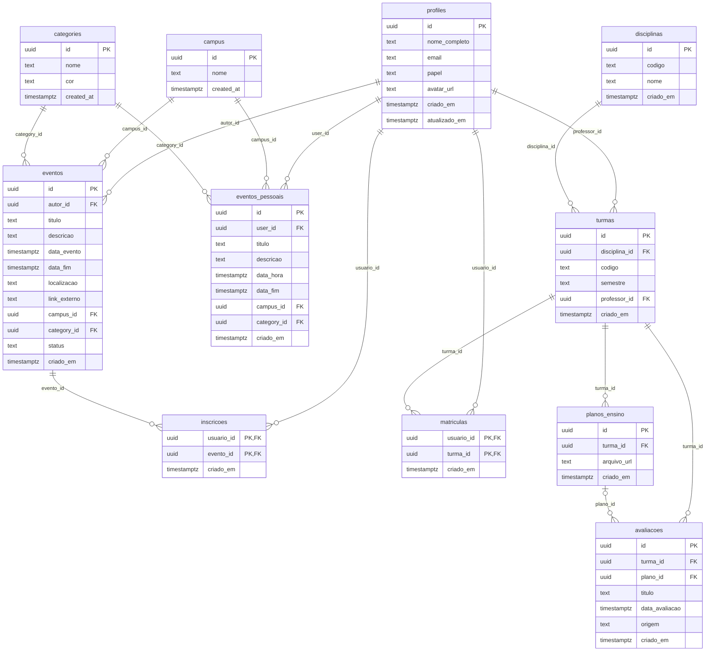
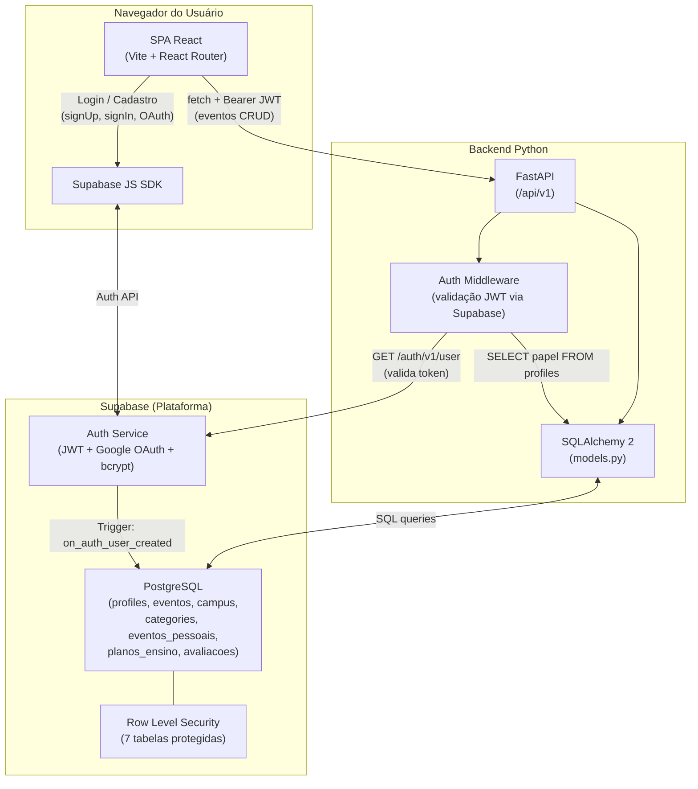
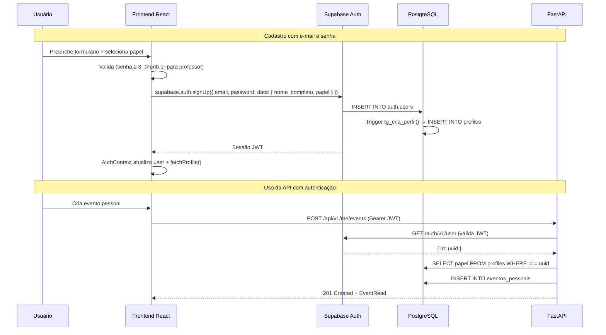

# Release Note — Agenda UnB v0.1.0

**Data:** 28 de setembro de 2026  
**Equipe:** Grupo G8 — Métodos de Desenvolvimento de Software, 2026/2  
**Repositório:** [unb-mds/2026-2-AgendaUnB](https://github.com/unb-mds/2026-2-AgendaUnB)

---

## 1. Visão Geral do Produto

O **Agenda UnB** é uma plataforma web centralizada para a comunidade da Universidade de Brasília que resolve um problema concreto: a informação que organiza a rotina de um estudante está fragmentada em canais desconectados — a grade está no SIGAA, as datas de prova estão em PDFs de planos de ensino abertos apenas na primeira semana, e os eventos circulam por Instagram, cartazes e grupos de WhatsApp.

A plataforma reúne dois eixos principais:

1. **Agenda do Campus** — Divulgação e consulta de eventos acadêmicos, culturais e esportivos de todos os campi (Darcy Ribeiro, FCTE/Gama, FCTS/Ceilândia, FUP/Planaltina e FAL).
2. **Organizador Acadêmico** — Calendário pessoal do estudante com eventos privados e, futuramente, alimentado automaticamente a partir da extração de datas de planos de ensino.

### Posicionamento

| | Agenda UnB | Google Calendar | SIGAA |
|---|---|---|---|
| Eventos do campus | Sim — Catálogo público filtrável | Não — Exige cadastro manual | Não — Não cobre eventos |
| Prazos acadêmicos | Sim — Agenda pessoal integrada | Não — Cadastro manual | Não — Sem cronograma de avaliações |
| Extração de plano de ensino | Planejado | Não | Não |
| Autenticação institucional | Sim — Google OAuth + @unb.br | Parcial | Sim |

---

## 2. Stack Tecnológica

| Camada | Tecnologia | Versão | Papel no Projeto |
|--------|-----------|--------|-----------------|
| **Frontend** | React | 19.x | Biblioteca de UI — componentização da SPA |
| **Bundler** | Vite | 6.x | Dev server com HMR e build de produção |
| **Roteamento** | React Router | 7.x | Navegação SPA entre as 3 rotas da aplicação |
| **Backend** | Python + FastAPI | 3.x / 0.115+ | API REST com validação automática e docs OpenAPI |
| **ORM** | SQLAlchemy | 2.x | Mapeamento objeto-relacional das tabelas do Supabase |
| **Validação** | Pydantic | 2.x | Schemas de entrada/saída tipados para a API |
| **HTTP Client** | httpx | 0.28+ | Validação de JWT com a API do Supabase Auth |
| **Banco de Dados** | PostgreSQL | 15+ | Dados relacionais (via Supabase) |
| **Autenticação** | Supabase Auth | — | Gestão de sessões, Google OAuth, senhas bcrypt |
| **SDK Frontend** | @supabase/supabase-js | 2.x | Chamadas de Auth e queries diretas do navegador |
| **Migrações** | Supabase Migrations | — | 5 migrações SQL versionadas |
| **Ambiente Local** | Supabase CLI + Docker | — | PostgreSQL, Auth e Studio locais via `supabase start` |
| **Documentação** | MkDocs Material | — | Site de documentação publicado no GitHub Pages |
| **Tipografia** | Google Fonts (Orbitron + Inter) | — | Fontes display (Sci-Fi) e body (legibilidade) |
| **Iconografia** | Material Symbols (Google) | — | Ícones consistentes em toda a UI |

---

## 3. Funcionalidades Entregues

### 3.1 Frontend

#### Landing Page (`/`)

A página inicial da aplicação serve como portal de entrada e vitrine do projeto:

- **Hero Section** — Título "AGENDA UNB" em Orbitron com vídeo de shader animado em loop (versões dark e light distintas), otimizado com `IntersectionObserver` para pausar quando fora da viewport.
- **Seção de Funcionalidades** — Grade de 6 cards com ícones Material Symbols apresentando as capacidades do produto: Agenda Unificada, Submissão de Eventos, Planos de Ensino, Moderação, Importação Automática e Inscrição Direta.
- **Seção Sobre** — Descrição do projeto e sua proposta de valor.
- **Seção Equipe** — Cards dos 6 integrantes do Grupo G8 com foto do GitHub, papel na equipe, link do GitHub e e-mail.
- **Footer** — Logo da UnB e créditos.

#### Autenticação

O sistema de autenticação implementa dois fluxos completos:

- **Cadastro com e-mail e senha** — Modal com campos de nome completo, e-mail, senha e confirmação de senha. Inclui seletor de papel (Estudante / Professor) que determina as validações aplicadas.
- **Login com e-mail e senha** — Modal dedicado com campos de e-mail e senha.
- **Login com Google OAuth** — Botão "Continuar com Google" que redireciona para o fluxo OAuth do Supabase, disponível tanto no cadastro (apenas para estudantes) quanto no login.
- **Validação de papel Professor** — O frontend verifica se o e-mail termina em `@unb.br` (excluindo `@aluno.unb.br`) antes de permitir o cadastro como professor. Esta mesma regra é enforced no banco de dados via CHECK constraint.
- **Promoção para Professor** — Função `promoverParaProfessor()` permite que um usuário logado via Google altere seu papel para professor, desde que possua e-mail institucional.
- **Gestão de sessão** — O `AuthContext` gerencia estado do usuário, perfil, loading e funções de autenticação para toda a aplicação.

#### Página de Eventos (`/segunda-pagina`)

Interface principal de uso da plataforma:

- **Toggle Públicos / Meus Eventos** — Alterna entre a visão de eventos públicos aprovados (aberta a todos) e eventos pessoais do usuário logado.
- **Barra de busca** — Pesquisa textual em tempo real pelo título dos eventos.
- **Filtros avançados** — Três dropdowns customizados para filtrar por:
    - **Área** — Acadêmico, Cultura, Esporte, Extensão, Lazer, Comunicado
    - **Campus** — Darcy Ribeiro, FCTE (Gama), FCTS (Ceilândia), FUP (Planaltina), FAL
    - **Turno** — Matutino (06h–12h), Vespertino (12h–18h), Noturno (18h–06h)
- **Grid de cards de eventos** — Layout responsivo com ícone da área, título, data formatada, descrição truncada e tags de campus/local.
- **Criação de eventos** — Modal completo com:
    - Campos: título, descrição, data (DatePicker customizado), horário (TimePicker customizado), campus, área, local exato, visibilidade e link externo
    - Visibilidade: Público (apenas professor/admin) ou Privado (qualquer logado)
- **Edição de eventos pessoais** — Reabre o modal preenchido com os dados do evento existente.
- **Exclusão de eventos** — Botão de excluir com chamada à API.

#### Página de Detalhe do Evento (`/evento/:id`)

Página dedicada para cada evento com layout de duas colunas:

- **Coluna principal** — Badges de categoria e campus, título em destaque, box do organizador (avatar + nome) e descrição completa com formatação de parágrafos, subtítulos em negrito e listas.
- **Coluna lateral** — Card com data, local, botão "Conferir Evento" (abre link externo), contador de interessados e botão de compartilhar (copia URL).
- **Carregamento assíncrono** — Tenta buscar primeiro como evento público; se falhar e houver usuário logado, tenta como evento pessoal.

#### Componentes Reutilizáveis

- **NavBar** — Barra de navegação fixa com glassmorphism, adaptável a 3 contextos (home, second, evento). Inclui toggle de tema, avatar do usuário, botão de logout e links de navegação contextuais.
- **CustomSelect** — Dropdown customizado com estilo glassmorphism, suporte a `dropUp` e fechamento ao clicar fora.
- **CustomDatePicker** — Calendário mensal interativo com navegação entre meses, destaque do dia selecionado e do dia atual.
- **CustomTimePicker** — Seletor de hora e minuto em duas colunas com scroll, header estilizado e auto-scroll para o valor selecionado.

#### Tema Dark / Light

- Alternância completa via toggle na navbar.
- A classe `dark` ou `light` é aplicada ao `<body>`, e as variáveis CSS reagem.
- Vídeo de fundo do Hero troca entre `shaderopt-dark.webm` e `shaderopt-light.webm`.
- Todos os componentes (modais, cards, inputs, navbar) respondem ao tema.

---

### 3.2 Backend (API FastAPI)

A API REST serve como camada intermediária entre o frontend e o banco PostgreSQL, aplicando regras de negócio e controle de acesso.

#### Autenticação e Autorização

- **Middleware `get_current_user`** — Extrai o token Bearer do header `Authorization`, valida-o contra o endpoint `/auth/v1/user` do Supabase via `httpx`, e busca o papel do usuário na tabela `profiles`.
- **Guard `require_event_manager`** — Restringe criação e exclusão de eventos públicos a usuários com papel `professor` ou `admin`.
- **Respostas de erro** — 401 para sessão inválida/expirada, 403 para perfil não encontrado ou permissão insuficiente, 503 quando o Supabase está inacessível.

#### Módulo de Eventos

CRUD completo com separação clara entre eventos públicos e pessoais:

- **Eventos públicos** — Apenas os com `status = 'aprovado'` são retornados nas consultas. Professores e admins criam eventos que nascem já aprovados. Filtros por campus, categoria, intervalo de datas e busca textual por título.
- **Eventos pessoais** — Isolados por `user_id`: cada usuário só vê, edita e exclui os próprios eventos.

#### Validação e Tratamento de Erros

- **Schemas Pydantic** — `EventCreate`, `EventUpdate`, `PersonalEventCreate`, `PersonalEventUpdate` com validações de comprimento mínimo/máximo, formato de URL (`HttpUrl`) e obrigatoriedade de fuso horário (`ISO 8601`).
- **Exception handlers globais** — `IntegrityError` retorna 409 (conflito), `SQLAlchemyError` retorna 503 (serviço indisponível).
- **CORS** — Configurado para aceitar origens do dev server (`localhost:5173`), extensível via variável de ambiente `CORS_ORIGINS`.

---

### 3.3 Camada de Dados

#### Esquema do Banco de Dados

O banco foi estruturado através de **5 migrações SQL versionadas** no diretório `supabase/migrations/`:

| # | Migração | Tabela(s) | Descrição |
|---|----------|-----------|-----------|
| 1 | `20260922195137` | `profiles` | Perfis de usuário com CHECK constraints, triggers e RLS |
| 2 | `20260923000000` | `campus`, `categories` | Tabelas de referência com RLS pública |
| 3 | `20260923004151` | `eventos_pessoais` | Eventos privados com RLS por proprietário |
| 4 | `20260923172640` | `eventos`, `planos_ensino`, `avaliacoes` | Eventos públicos, planos de ensino e avaliações |
| 5 | `20260929011710` | `profiles` (alter) | Adiciona coluna `avatar_url` |

#### Modelo Entidade-Relacionamento

#### Segurança no Banco (Row Level Security)

Todas as tabelas possuem RLS habilitado. As políticas implementadas garantem:

| Tabela | Operação | Política |
|--------|----------|----------|
| `profiles` | SELECT | Visível para todos (inclusive visitantes) |
| `profiles` | UPDATE | Apenas o próprio usuário (`id = auth.uid()`) |
| `profiles` | INSERT | Apenas via trigger `on_auth_user_created` |
| `campus` | SELECT | Leitura pública |
| `categories` | SELECT | Leitura pública |
| `eventos` | SELECT | Apenas eventos com `status = 'aprovado'` |
| `eventos` | INSERT | Apenas usuários autenticados, com `autor_id = auth.uid()` |
| `eventos_pessoais` | SELECT / INSERT / UPDATE / DELETE | Apenas o proprietário (`user_id = auth.uid()`) |
| `avaliacoes` | SELECT | Leitura pública |

#### Triggers e Regras de Integridade

- **`tg_cria_perfil`** — Trigger `AFTER INSERT ON auth.users` que cria automaticamente o perfil na tabela `profiles`. Extrai o nome do metadata do Supabase Auth (com fallback para a parte antes do `@` do e-mail). Valida que professores tenham e-mail `@unb.br` e impede que `admin` seja definido via cadastro.
- **`tg_email_imutavel`** — Trigger `BEFORE UPDATE ON profiles` que impede alteração do campo `email`, fechando o vetor de ataque onde o usuário trocaria o e-mail para `@unb.br` e se promoveria a professor.
- **`tg_atualiza_timestamp`** — Trigger `BEFORE UPDATE ON profiles` que atualiza `atualizado_em` automaticamente.
- **CHECK constraint `professor_exige_email_institucional`** — Garante no nível do banco que `papel = 'professor'` exige `email ~* '@unb\.br$'`.

---

## 4. Arquitetura da Aplicação

### Fluxo de Autenticação

---

## 5. Endpoints da API Implementados

| Método | Rota | Descrição | Auth | Papel |
|--------|------|-----------|:----:|:-----:|
| `GET` | `/api/v1/events` | Listar eventos públicos aprovados | — | — |
| `GET` | `/api/v1/events/{id}` | Detalhe de um evento público | — | — |
| `POST` | `/api/v1/events` | Criar evento público (nasce aprovado) | Sim | Professor / Admin |
| `DELETE` | `/api/v1/events/{id}` | Excluir evento público | Sim | Professor / Admin |
| `GET` | `/api/v1/me/events` | Listar eventos pessoais do usuário | Sim | Qualquer |
| `GET` | `/api/v1/me/events/{id}` | Detalhe de evento pessoal | Sim | Dono |
| `POST` | `/api/v1/me/events` | Criar evento pessoal | Sim | Qualquer |
| `PUT` | `/api/v1/me/events/{id}` | Atualizar evento pessoal | Sim | Dono |
| `DELETE` | `/api/v1/me/events/{id}` | Excluir evento pessoal | Sim | Dono |
| `GET` | `/health` | Health check do servidor | — | — |

### Filtros disponíveis em `GET /api/v1/events`

| Parâmetro | Tipo | Descrição |
|-----------|------|-----------|
| `campus` | string | Filtra por nome do campus (case-insensitive) |
| `category` | string | Filtra por nome da categoria (case-insensitive) |
| `startDate` | ISO 8601 | Eventos a partir desta data |
| `endDate` | ISO 8601 | Eventos até esta data |
| `q` | string | Busca textual no título (ILIKE) |
| `limit` | int (1–100) | Quantidade máxima de resultados (default: 50) |
| `offset` | int (≥ 0) | Paginação por offset |

---

## 6. Requisitos Funcionais Atendidos

| ID | Requisito | Implementação |
|:---|:----------|:--------------|
| **RF01** | Autenticação Local | Login com e-mail e senha via Supabase Auth. Senhas armazenadas com bcrypt. |
| **RF02** | Cadastro de Usuários | Modal de cadastro com nome completo, e-mail, senha e confirmação. Perfil criado automaticamente via trigger no banco. |
| **RF03** | Autenticação Google (OAuth) | Botão "Continuar com Google" integrado ao Supabase OAuth. Redirect para `/segunda-pagina` após login. |
| **RF04** | Categorização por Papel (Role) | Seletor Estudante/Professor no cadastro. Professor exige `@unb.br` (validado no frontend, no trigger e no CHECK do banco). Admin definido manualmente. RBAC enforced no middleware da API. |
| **RF09** | Gestão de Eventos Privados (CRUD) | CRUD completo de eventos pessoais via API (`/me/events`) com RLS no banco. Frontend com criação, edição e exclusão. |
| **RF10** | Submissão de Eventos Públicos | Professores e admins podem criar eventos públicos via modal. Eventos nascem aprovados na versão atual. |
| **RF14** | Resumo e Detalhes do Evento | Página dedicada `/evento/:id` com descrição completa, data, horário, local, organizador e link externo. |
| **RF15** | Divulgação Multi-campus | Dropdown de campus cobrindo Darcy Ribeiro, FCTE (Gama), FCTS (Ceilândia), FUP (Planaltina) e FAL. Filtro implementado na API e no frontend. |
| **RF19** | Filtros e Busca de Eventos | Filtros por categoria, campus e turno no frontend. API suporta filtros por campus, categoria, intervalo de datas e busca textual. |
| **RF20** | Alternância de Tema (Dark / Light) | Toggle na navbar com transição completa. Todos os componentes respondem ao tema. Vídeo de fundo troca com o tema. |

## Requisitos Não Funcionais Atendidos

| ID | Requisito | Implementação |
|:---|:----------|:--------------|
| **RNF01** | Criptografia de Credenciais | Supabase Auth armazena senhas com bcrypt (cost factor padrão ≥ 10). |
| **RNF04** | Controle de Acesso (RBAC) | Middleware `require_event_manager` restringe gestão de eventos públicos a professor/admin. CHECK constraints no banco impedem escalação de privilégio. |
| **RNF07** | Design Responsivo | Layout com `auto-fill` grid, `clamp()` para tipografia, e componentes que se adaptam a telas de 360px+. |
| **RNF09** | Feedback Visual | Mensagens de erro em vermelho nos modais, estado "Criando..." / "Entrando..." nos botões, alerta de erro ao carregar eventos, estados de carregamento e empty state. |
| **RNF10** | Resiliência no Upload | Tratamento de erros na API com `IntegrityError` → 409, `SQLAlchemyError` → 503, e mensagens amigáveis no frontend. |
| **RNF12** | Compatibilidade entre Navegadores | SPA com React 19 + Vite, usando APIs web padrão (`IntersectionObserver`, `fetch`, CSS custom properties). |

---

## 7. Design System e Identidade Visual

### Creative North Star: "The Neon Campus"

A identidade visual mescla rigor acadêmico com futurismo digital. A interface adota uma estética predominantemente *dark*, focada no alto contraste e na modernidade.

### Paleta de Cores

| Token | Valor | Uso |
|-------|-------|-----|
| **Azul UnB Glow** | `#008bff` | Cor vital — avatares, bordas, rótulos, efeitos glow |
| **Azul Deep** | `rgba(0, 95, 210, 1)` | Fundo sólido de botões primários |
| **Void Background** | `#050508` | Fundo raiz (dark) |
| **Light Background** | `#f0f4f8` | Fundo raiz (light) |
| **Glass Surface** | `rgba(8, 12, 22, 0.78)` | Modais e cards flutuantes (dark) |
| **White High** | `#ffffff` | Texto principal e ícones ativos |
| **White Medium** | `rgba(255, 255, 255, 0.55)` | Texto de apoio e placeholders |

### Tipografia

| Nível | Fonte | Peso | Uso |
|-------|-------|------|-----|
| **Display** | Orbitron | 700 | Títulos de seções, logo, cabeçalhos de modal |
| **Title** | Inter | 600 | Títulos de cards |
| **Body** | Inter | 400 | Descrições, formulários, leitura longa |
| **Label** | Inter | 600–700, uppercase | Rótulos de inputs, categorias, badges |

### Princípios Visuais

- **Glassmorphism** — Fundos translúcidos com `backdrop-filter: blur()` criam profundidade sem sombras pesadas.
- **Glow-Over-Shadow Rule** — Em vez de sombras pretas, usamos `rgba(0, 139, 255, 0.12)` para criar aspecto de luz emitindo da borda do componente.
- **Sem gradientes lineares** — Cores sólidas (flat) ou glassmorphism neutro. Gradientes estão terminantemente proibidos.
- **Sombras ≤ 20% opacidade** — Máximo de `rgba(0,0,0,0.2)`. Elevação é alcançada com backdrop-filter e glow.
- **Iconografia** — Exclusivamente Material Symbols. Emojis proibidos como elementos de UI.

### Shapes

| Contexto | Border Radius |
|----------|---------------|
| Navbar, filtros, badges | `999px` (pill) |
| Cards e modais | `14px` a `20px` |
| Inputs | `10px` |

---

## 8. Links Úteis

| Recurso | Link |
|---------|------|
| Documentação (GitHub Pages) | [unb-mds.github.io/2026-2-AgendaUnB](https://unb-mds.github.io/2026-2-AgendaUnB/) |
| Figma | [Board no Figma](https://www.figma.com/board/RlZe9FgO3Bz3gPkxevs8UJ/AGENDA-UNB?node-id=1-217&t=USKjIQh4OXxQVwsG-1) |
| Miro | [Board no Miro](https://miro.com/welcomeonboard/b0lMYXFqaEFMTnNpejdUOE1tLy8rOGNHdk5QVndFOUN0ZTFtc1kvWC9UUWdCbUJXVkpFU2JKRXhqUHpRZEYxekt6NUNFZXNzOXkxVDRxRmk0TjI1akdVY0Q5QW0vUENuMVpvYWRaZzdVNFZ3bnBlKzQzU0llYmpHQ25HNS93Y210R2lncW1vRmFBVnlLcVJzTmdFdlNRPT0hdjE=?share_link_id=751569582229) |
| Repositório | [github.com/unb-mds/2026-2-AgendaUnB](https://github.com/unb-mds/2026-2-AgendaUnB) |

---

## Equipe G8

| Nome | Papel | GitHub |
|------|-------|--------|
| Thomas Augusto Amorim de Araujo | Frontend | [@thomas4ugust0](https://github.com/thomas4ugust0) |
| Gabriel Escramin Lourenço | Frontend | [@Bielziin07](https://github.com/Bielziin07) |
| Heitor Gomes Monteiro | Backend | [@heitormontt](https://github.com/heitormontt) |
| Thomaz Marra Martins | Backend | [@marrathomaz](https://github.com/marrathomaz) |
| Felipe Couto Duque | Banco de Dados | [@felipecduque7](https://github.com/felipecduque7) |
| Luis Davi Pontes da Silva | Banco de Dados | [@pontesluis](https://github.com/pontesluis) |
